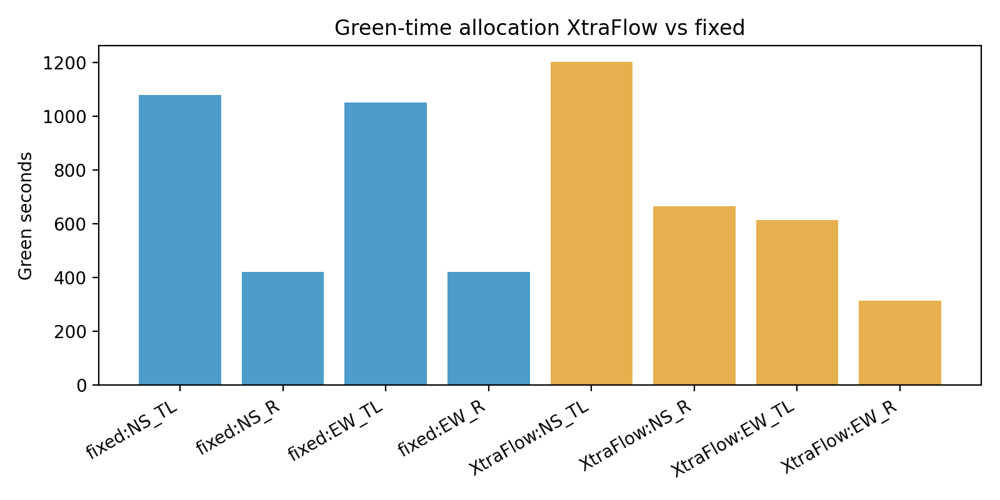
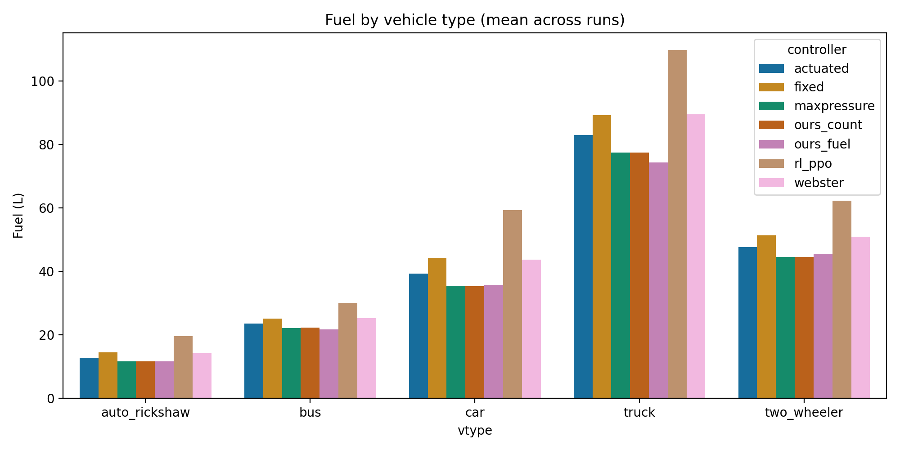
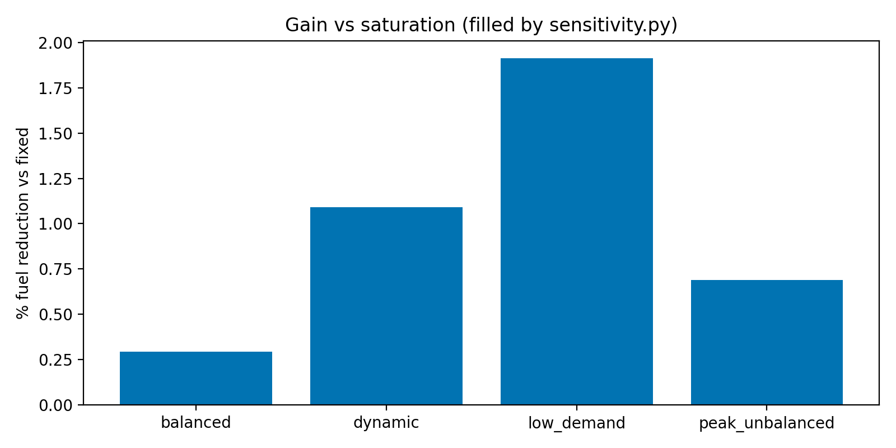
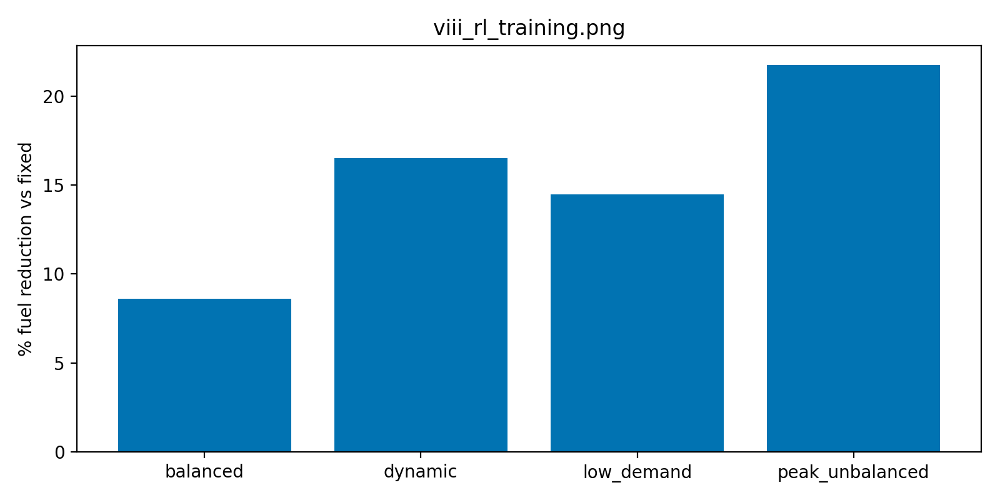
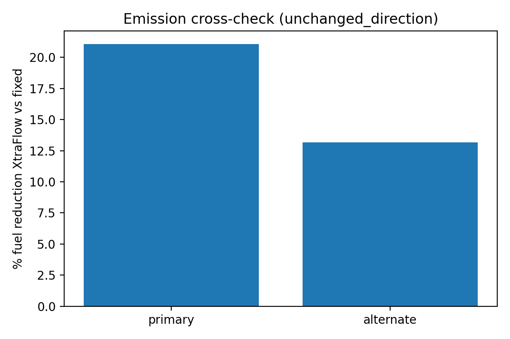
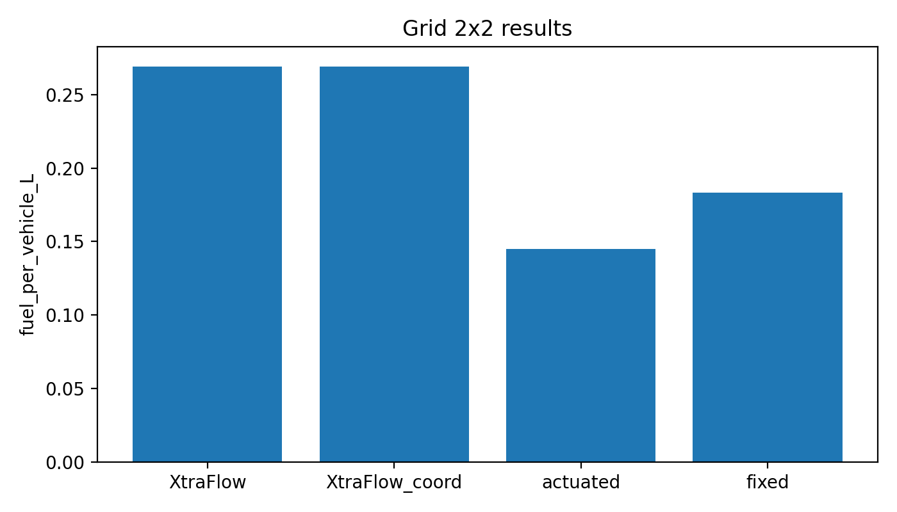
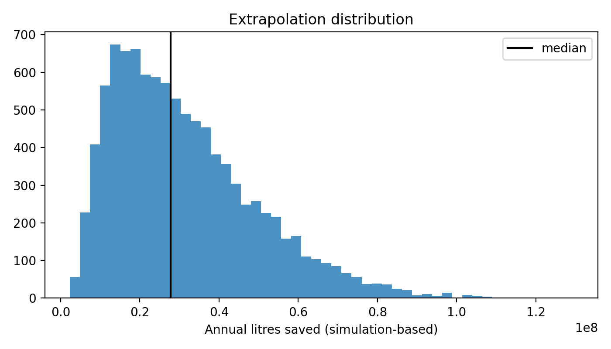
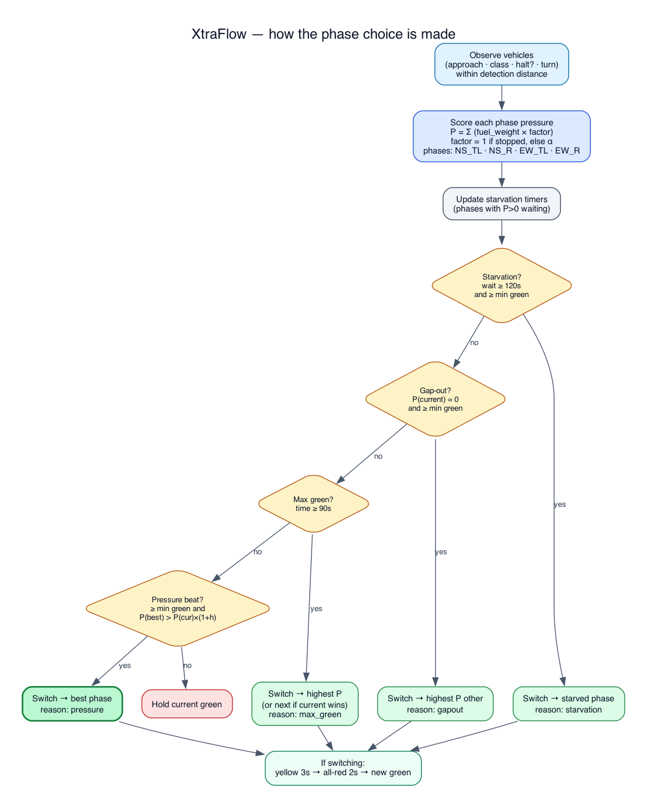

# XtraFlow

**Adaptive pressure control cuts fuel about 8–17% vs fixed / Webster / actuated; fuel weighting adds about 0–2%.**

XtraFlow is a SUMO-based signal control stack for mixed urban traffic. It scores approaches by estimated fuel pressure—who is waiting, what they burn, and which turn they need—then serves the phase that clears the most costly delay under hard safety constraints. On the locked TEST (n=5 seeds), most of the gain is adaptive pressure versus fixed-style baselines; class fuel weights barely move the needle except at low demand.


<p align="center"><em>Same demand seed · fixed timing (left) · XtraFlow (right)</em></p>

### Story video — which roads move when


<p align="center"><em>Hypothesis on camera: detect → fuel-weighted pressure → green / yellow / all-red · <a href="results/demo/yolo/yolo_story.mp4">full MP4</a> · input feasibility, not a fuel claim</em></p>

> Simulation-based estimate · assumed traffic mix · oracle detector unless camera mode is on · proxy emission classes. Not a field deployment result.

---

## Why XtraFlow

| Classic pressure | XtraFlow |
| --- | --- |
| Counts vehicles in queue | Weights idle / stop-go fuel by vehicle class |
| One-size green splits | Adapts every cycle under min/max green, yellow, all-red |
| Opaque “smart” claim | Locked configs, seeded demand, paired comparisons on disk |

Built for presentations, reproducible benchmarks, and engineering review—not marketing slides with invented percentages.

---

## What’s in the box

- **Fuel-weighted pressure controller** with starvation protection and shared timing constraints
- **Fair baselines** in one pipeline: legacy fixed, validation-tuned fixed, Webster, SUMO actuated, queue pressure, max-pressure (see caveat: published runs matched queue pressure), count-only ablation; PPO trained but **unscored**
- **Four demand patterns**: balanced, peak unbalanced, dynamic blocks, low demand
- **Locked evaluation**: train / validation / test seed split, config hash lock, tripinfo fuel and SSM safety
- **Extras**: detection-miss robustness, demand/mix sensitivity, emission cross-check, demo video, YOLO CCTV demo + story mosaic, auto-filled deck

---

## Evidence

Locked TEST (seeds **1–5**, four scenarios, eight controllers). Read the artifacts; do not invent percentages.

**What the numbers support**

| Comparison | Fuel change (XtraFlow better = positive) | Caveat |
| --- | --- | --- |
| vs fixed / Webster / actuated | about **8–17%** (scenario means; actuated is closer to 5–11%) | Adaptive pressure vs weaker baselines |
| vs best pressure baseline (`maxpressure` / `queue_pressure`) | **0.3–1.9%** | CIs include 0 on balanced and peak_unbalanced |
| vs count-only ablation (`ours_count`) | **~0–2%**; clear only on low_demand (~2%) | “no_detectable_difference” on 3/4 scenarios |
| Holm-adjusted Wilcoxon | all **p_holm = 1.0** | n=5 → minimum raw Wilcoxon p is 0.0625 |

| Artifact | What it is |
| --- | --- |
| [`results/headlines.json`](results/headlines.json) | Paired fuel change vs best tuned baseline (0.3–1.9%) |
| [`results/REPORT.md`](results/REPORT.md) | Full methods + tables |
| [`results/raw_runs.csv`](results/raw_runs.csv) | Every locked TEST run |
| [`results/deck.pptx`](results/deck.pptx) | Slide deck filled from those files |
| [`results/demo/yolo/yolo_story.gif`](results/demo/yolo/yolo_story.gif) / [`.mp4`](results/demo/yolo/yolo_story.mp4) | CCTV story: GO plays / other axis PAUSE frozen (feasibility demo) |
| [`STATE.md`](STATE.md) · [`results/CHANGES.md`](results/CHANGES.md) | Published scope and cuts |

### Figures

All PNGs under [`results/figures/`](results/figures/) (regenerated by `analyze.py` and the study scripts):

| Figure | What it shows |
| --- | --- |
| [`i_grouped_bars.png`](results/figures/i_grouped_bars.png) | Fuel, CO₂, wait, and queue by controller (mean±std) |
| [`ii_pct_reduction.png`](results/figures/ii_pct_reduction.png) | Paired % fuel reduction versus tuned baselines |
| [`iii_dynamic_queue_ts.png`](results/figures/iii_dynamic_queue_ts.png) | Queue time series on the dynamic scenario |
| [`iv_green_allocation.png`](results/figures/iv_green_allocation.png) | XtraFlow green-time share versus fixed timing |
| [`v_fuel_by_type.png`](results/figures/v_fuel_by_type.png) | Mean fuel by vehicle type |
| [`vi_gain_vs_saturation.png`](results/figures/vi_gain_vs_saturation.png) | Fuel gain versus demand-multiplier (DoS proxy) |
| [`vii_robustness.png`](results/figures/vii_robustness.png) | Fuel under rising detection-miss rates |
| [`viii_rl_training.png`](results/figures/viii_rl_training.png) | PPO training curve (unscored on TEST) |
| [`ix_emission_xcheck.png`](results/figures/ix_emission_xcheck.png) | Primary vs alternate emission classes |
| [`x_grid_results.png`](results/figures/x_grid_results.png) | 2×2 grid (TLS caveat — see `grid_results.json`) |
| [`xi_extrapolation.png`](results/figures/xi_extrapolation.png) | Placeholder scaled fuel / INR range |
| [`xtraflow_choice.png`](results/figures/xtraflow_choice.png) | Phase-choice sketch for fuel-weighted pressure |



















**Published package:** full-hour simulations, TEST seeds 1–5, eight controllers. PPO was trained to the config budget and kept on disk but **not scored** on VALIDATION or TEST—do not cite it as a result. Details in `STATE.md`.

---

## Quick start

```bash
python3.12 -m venv .venv
source .venv/bin/activate
make setup
make smoke          # short sanity sweep
# or the full protocol:
make all
```

Docker:

```bash
docker build -t xtraflow .
docker run --rm -v "$PWD/results:/app/results" xtraflow
```

Dashboard and deck after a run:

```bash
make demo
make deck
make dashboard        # Streamlit UI over SUMO results/
make yolo_demo        # 4-cam overlays + mosaic + GO/PAUSE story video
make yolo_dashboard   # Streamlit: story / clubbed / per-cam + decisions
```

---

## How it works

```text
demand (scenario + seed)
        │
        ▼
   SUMO network  ──►  TraCI loop  ──►  tripinfo + SSM
        │                  │
        │                  ├─ observe vehicles (oracle or camera noise)
        │                  ├─ fuel-weighted phase pressure
        │                  └─ serve under min/max green, yellow, all-red
        ▼
  results/raw_runs.csv → analyze → figures, REPORT, deck
```

Controllers share the same network, demand files, and timing hard rules. Demand is regenerated from scenario + seed only—never from the controller under test.

**Seeds:** TRAIN `1000–1049` · VALIDATION `2000–2019` · TEST `1–30` (config). Tuning and fixed-plan search stay on VALIDATION. The publish on this branch used TEST seeds `1–5` after `results/config.lock`.

---

## Bring your own data

| Input | Path | Effect |
| --- | --- | --- |
| Observed approach counts | `data/observed_counts.csv` | Scales demand / GEH calibration |
| Road video you have rights to | `data/video/` | YOLO counts + overlay / story demo |
| Manual labels | `data/video_labels/` | Empirical noise model |

```bash
python -m perception.yolo_counts --video data/video/YOUR.mp4 --roi perception/roi.yaml
python -m perception.evaluate_detector
make yolo_demo        # overlays, mosaic, decisions, GO/PAUSE story
make yolo_dashboard   # http://localhost:8501 by default (or set --server.port)
```

**YOLO demo (input feasibility — not a fuel-saving result)**

Place up to four clips as `data/video/cam_{N,E,S,W}_hwy.mp4` (preferred) or Bellevue-style names; `data/video/` is gitignored. Needs `ultralytics` + `lapx` (ByteTrack). Then:

| Step | Command / artifact |
| --- | --- |
| Run pipeline | `make yolo_demo` |
| Story video (GO/PAUSE mosaic) | [`results/demo/yolo/yolo_story.mp4`](results/demo/yolo/yolo_story.mp4) |
| 2×2 mosaic | `results/demo/yolo/yolo_mosaic.mp4` |
| Per-cam overlays | `results/demo/yolo/overlay_{N,E,S,W}.mp4` |
| Counts + phase timeline | `results/demo/yolo/counts_*.json`, `yolo_demo_summary.json` |
| UI | `make yolo_dashboard` → **Story video** · clubbed · per-cam · **Decisions & fuel** |

The story follows the controller hypothesis: **detect who waits → score fuel-weighted phase pressure → serve under green / yellow / all-red**. GO plays, YELLOW still rolls while clearing, ALL RED and the waiting axis **PAUSE** (frozen). Bars show phase fuel pressure. Min-green is scaled to the short clip; yellow/all-red match `config.yaml`. Clip idle-fuel figures are illustrative; published % fuel cuts stay in [`results/headlines.json`](results/headlines.json). Provenance: [`results/demo/yolo/SOURCE.md`](results/demo/yolo/SOURCE.md).

Only use datasets you are allowed to use. Nothing unlicensed is downloaded by this repo.

---

## Repository map

```text
sim/           network, demand, controllers, RL env, metrics
experiments/   calibrate, tune, train, sweep, analyze, studies
perception/    detector counts + noise model
demo/          side-by-side SUMO demo, YOLO pipeline, story video, dashboards
deck/          PowerPoint builder
results/       locked runs, figures, REPORT, deck, YOLO demo outputs
docs/          design decisions
```

Common Make targets:  
`setup` · `test` · `smoke` · `calibrate` · `tune` · `train_rl` · `sweep` · `analyze` · `robustness` · `sensitivity` · `emission_xcheck` · `safety` · `demo` · `yolo_demo` · `yolo_dashboard` · `deck` · `audit` · `all`

---

## Honest limits

- Simulation only; assumed vehicle mix unless you supply counts
- Default information mode is an **oracle** (SUMO speed, class, route turn)
- Emission classes are **proxies** (HBEFA3 / PHEMlight on the pinned SUMO wheel); auto-rickshaw shares the car class, so its fuel weight is 1.0
- The large 8–17% cuts are **adaptive pressure vs fixed / Webster / actuated**, not class fuel weighting (about 0–2% vs `ours_count`)
- TEST used **n=5** seeds; Holm-adjusted tests cannot reject at α=0.05 (all p_holm = 1.0)
- In the published `raw_runs.csv`, `maxpressure` is **bit-identical** to `queue_pressure` (downstream term was effectively zero). Treat them as one baseline until a re-run after the occupancy fix in `sim/controllers.py`
- `results/sensitivity.json` waiting times are **stale / invalid** for many rows (parallel tripinfo clobber + missing mix key); fuel columns may still be usable—re-run sensitivity after the code fix
- YOLO CCTV demo is **input feasibility**; fuel headlines come from SUMO, not from those clips
- PPO zip on disk is **unscored**; 2×2 grid is unscored—see `results/grid_results.json`

Design rationale: [`docs/DECISIONS.md`](docs/DECISIONS.md)
