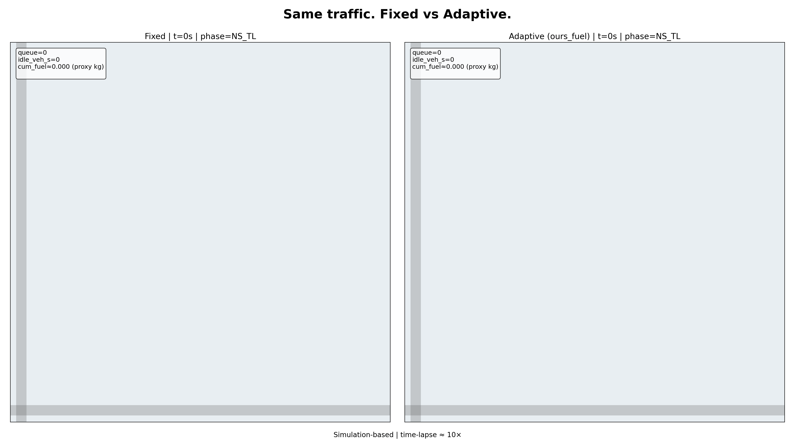
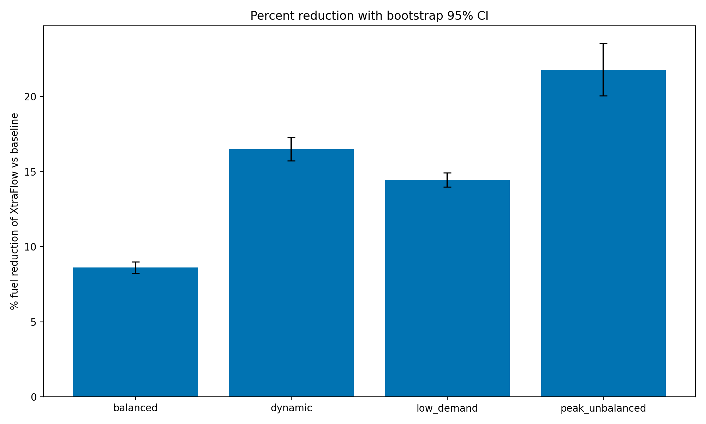
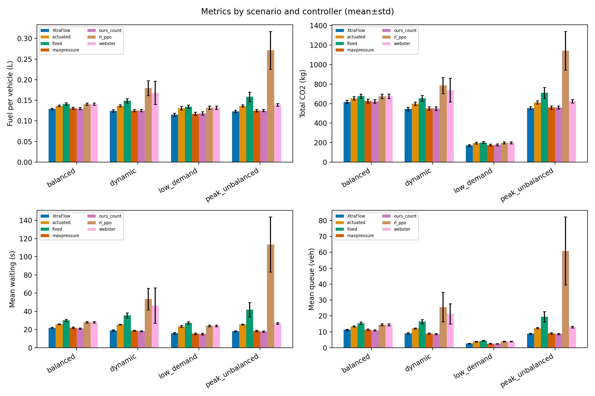
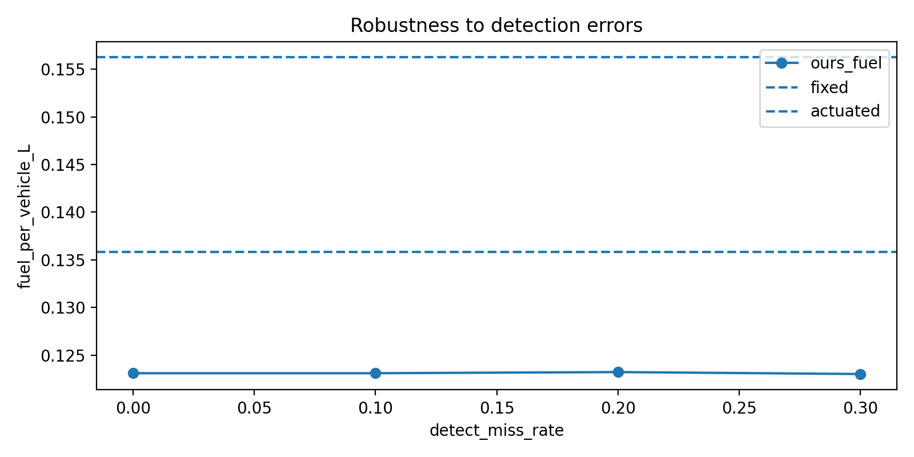

# XtraFlow

Fuel-weighted traffic signals. Reproducible SUMO study for an IndianOil presentation.

**Label:** Simulation-based estimate; not a real-world deployment result.  
**Traffic mix:** assumed mixed-traffic scenario unless you supply observed counts.



## Results

**Published scope (2026-10-06 time-cut):** locked TEST seeds **1–5**, eight controllers (PPO trained but not in this comparison), four scenarios, full demand horizon. Numbers live in the result files; this page does not restate them.

- Headlines vs best tuned baseline: `results/headlines.json`
- Per-run table: `results/raw_runs.csv`
- Report: `results/REPORT.md`
- What changed / cuts: `results/CHANGES.md`, `STATE.md`

Oracle detector unless `controller.info_mode` is `camera`. Assumed traffic mix. Emission classes are proxies. Simulation-based estimate; assumed traffic mix.



Detection-miss figure (numbers are in `results/robustness.json`):



Grid: not scored in this publish. See the note in `results/grid_results.json`.

## One-command reproduction

```bash
python3.12 -m venv .venv
source .venv/bin/activate
make setup
make all
```

Or with Docker:

```bash
docker build -t xtraflow .
docker run --rm -v "$PWD/results:/app/results" xtraflow
```

`make all` is the full protocol (TEST 1–30, including RL scoring). The published time-cut used fewer TEST seeds and omitted `rl_ppo` from the sweep; see `STATE.md`.

## Expected runtime


| Stage                          | Approx.                |
| ------------------------------ | ---------------------- |
| setup + networks + pytest      | 10–20 min              |
| smoke (controllers)            | 5–15 min               |
| calibrate + tune (VALIDATION)  | 1–3 h                  |
| fixed_tuned search             | several hours          |
| train_rl (200000 steps)        | many hours (1 env)     |
| TEST sweep (full 1–30)         | 8–20 h (CPU-dependent) |
| published time-cut TEST (1–5)  | ~30–60 min             |
| analyze + extras + demo + deck | 1–3 h                  |


## Folder guide

- `sim/` — network, demand, controllers, RL env, metrics
- `experiments/` — calibrate, tune, train, sweep, analyze, robustness, …
- `perception/` — YOLO counting + noise model
- `demo/` — side-by-side MP4 + Streamlit dashboard
- `deck/` — auto-filled pptx
- `results/` — raw_runs.csv, summary.json, figures, REPORT.md, deck.pptx
- `docs/DECISIONS.md` — design choices
- `STATE.md` — published status / resume point


## Seed protocol

- TRAIN `1000–1049` (RL only)
- VALIDATION `2000–2019` (tuning / fixed-plan search / intended RL selection)
- TEST in config: `1–30` (once, after `results/config.lock`)
- **This publish:** TEST seeds `1–5` after the lock; PPO not scored on TEST


## Supply real video and counts

1. Place videos in `data/video/`
2. Place manual counts/boxes in `data/video_labels/`
3. `python -m perception.yolo_counts --video data/video/YOUR.mp4 --roi perception/roi.yaml`
4. `python -m perception.evaluate_detector` → writes `perception/noise_model.json`

For demand calibration: place `data/observed_counts.csv` with columns `approach,count_veh_h`.

**Licensing:** only use datasets you have rights to; do not download unlicensed content.

## Emission class mapping

Runtime probe writes `results/emission_class_map.json`. On `eclipse-sumo==1.21.0` the wheel provides **HBEFA3** and **PHEMlight** (not HBEFA4). Primary mapping uses HBEFA3; emission cross-check uses PHEMlight when available.

## Makefile targets

`setup test smoke calibrate tune train_rl sweep analyze robustness sensitivity emission_xcheck safety perception grid extrapolate demo dashboard deck report audit all`

---


<!-- audit:ignore-start -->
# Fix and harden plan (historical)

This section is the original hardening checklist. The time-cut study that implements it is published; see `STATE.md` and `results/CHANGES.md` for what actually ran.

Review findings for the SUMO fuel-weighted traffic-signal study. Work proceeds in phase order. After each phase, `pytest` and a smoke run must both pass before the next phase starts.

**Label on every result:** Simulation-based estimate; assumed traffic mix.

## Global rules

- Never hardcode result numbers (percentages, "flat", "no increase", and similar verdicts) in the report, deck, README, or docs. Load them from `results/*.json` and `results/*.csv`, and make verdict text conditional on the data.
- Seed protocol is fixed: TRAIN `1000–1049`, VALIDATION `2000–2019`, TEST `1–30`. Tuning, baseline selection, and RL checkpoint selection use VALIDATION only. TEST is run once, after the lock.
- No absolute paths in any committed file. Use paths relative to the repo root.
- Keep every published figure and sentence labelled "Simulation-based estimate; assumed traffic mix".


## Phase 0 — Repo hygiene

- Delete `results/raw_runs_corrupt_backup.csv` and `results/grid.log` (repeated "Edge 'N_in' is not known"). Ignore `*.log` and `results/raw_runs_*backup*.csv`.
- `config.yaml` says HBEFA4 while the run uses HBEFA3. Make config match reality (or read `results/emission_class_map.json`) and fix README and REPORT wording.
- Remove dead code in `experiments/tune.py` (`_eval_one`, `_ensure_run_one_params`, env-var hacks).
- Add GitHub Actions CI (Linux, Python 3.12): install requirements, run pytest. `requirements.txt` must install on Linux and macOS (drop the "macOS arm64" assumption).


## Phase 1 — Correctness bugs


### 1.1 Perception noise is a no-op

`set_noise_rng()` is never called, so each step uses a fresh `random.Random(0)`. The same vehicle positions are always dropped, and at a 10% miss rate nothing is dropped. `count_jitter_std` is never applied.

- In `run_one`, create `rng = random.Random(f"{scenario}-{controller}-{seed}-noise")` and call `ctrl.set_noise_rng(rng)`. Never fall back to `Random(0)`.
- Misses stay persistent per vehicle: a miss-episode model keyed by vehicle id (hash of seed + id), for example a 2-state Markov dropout whose mean burst length comes from `noise_model.json`, not an independent coin flip each second.
- Class confusion is also persistent per vehicle id.
- Apply `count_jitter_std`, or delete the field everywhere.
- Pass `run_id=f"miss{miss}"` into `run_one` from `experiments/robustness.py` so output files differ.
- Tests: with 30 fake vehicles and miss 0.3, long-run visible fraction is about 0.7 (tolerance 0.05) and no vehicle is permanently hidden or visible; same seed gives identical detections; a different seed gives different detections.
- Robustness is evaluation, so it uses TEST seeds 1–30 after the lock. Levels 0 / 10 / 20 / 30%, plus the empirical noise model. Include `fixed_tuned`, actuated, and max-pressure reference lines.


### 1.2 SSM safety parser

SUMO writes `<conflict>…<minTTC value="…"/>`. The parser looks for attributes on any element and always returns 0.

- Count `<conflict>` elements whose child `minTTC@value` is below the threshold. Also record PET and DRAC when those device measures are enabled.
- Report conflicts per 1000 vehicles.
- Test against `results/demo/*.ssm.xml` (160 and 128 conflicts) and a hand-made fixture.
- `experiments/safety.py`: paired Wilcoxon plus bootstrap CI on conflicts per 1000 vehicles versus each baseline. The verdict string comes from the CI: increase, no detectable change, or decrease.


### 1.3 Sublane never ran

netconvert 1.21 has no `--lateral-resolution` option, so the fallback always triggers and `results/sublane_fallback.json` says `used_sublane=false`. The report still says "sublane-capable".

- Remove that flag from netconvert. Set `<lateral-resolution value="0.4"/>` only in the sumocfg (`_write_sumocfg` already supports it).
- Probe with a 60 s sim with sublane on. Fail loudly if SUMO errors; no silent fallback. Write the truth to `sublane_fallback.json`.
- Re-check phase groups, `observe_vehicles` lane logic, demand (`departLane`), and gridlock rate.
- If sublane makes demand unstable, re-tune demand levels on VALIDATION and document it in `docs/DECISIONS.md` (update D004). If sublane is dropped, remove the claim from README, REPORT, and the deck.


### 1.4 Unfinished vehicles bias the fuel metric

`fuel_per_vehicle_L` averages only completed trips, so gridlocked runs look cheap.

- Enable unfinished-trip output (`--tripinfo-output.write-unfinished` if it exists in SUMO 1.21; otherwise accumulate per-vehicle fuel via TraCI).
- Report fuel per departed vehicle. Add `n_unfinished` and a `status` column (`ok` | `gridlock` | `error` | `timeout`).
- A run with `n_unfinished > 0` is flagged, excluded from paired headline stats, and reported separately.


### 1.5 Sweep error handling

`_worker` turns any crash into `gridlock_flag=1` with NaNs.

- Add `status` and `error` columns to `RAW_FIELDS`. Crashes become `status=error`, not gridlock.
- Fail the sweep summary if error rows exist.


### 1.6 Controller logic

- The starvation branch in `_adaptive_step` is unreachable (`max_green` 90 is below starvation 120, and it is an `elif` after max green). Track per-phase time since last green (`ControllerState.waiting_since` is unused) and force-serve any phase with demand waiting longer than `starvation_s`.
- `MaxPressureController` has no downstream term, so it is queue-length control. Add the outgoing-lane occupancy term (true max-pressure), or rename it `queue_pressure` everywhere (README, report, deck, `CONTROLLER_NAMES`, figures). Do both variants if cheap.
- Give every adaptive controller the same constraints and the same information. Document that controllers use SUMO ground truth (speed, class, route turn) as an "oracle detector", and add `info_mode: oracle | camera`, where camera mode uses the noise model and class map.
- Keep Webster, but compute it from VALIDATION-calibrated flows, not config demand (avoid leaking the true demand).


## Phase 2 — Fair baselines and claims

- The default fixed plan `[30, 12, 30, 12]` gives NS and EW equal green under 4:1 NS-heavy demand (104 s cycle) and is a strawman. A check on TEST seeds 1–5 dropped the peak gain from about 22% to about 9% with a shorter cycle. Those seeds were already looked at, so do not reuse the plans from that check.
- Add controller `fixed_tuned`: grid-search green splits and cycle length per scenario on VALIDATION seeds only (greens 10–45 s, step 5, respect `min_green`). Save to `results/fixed_tuned.json` and include it in the lock. Keep `fixed` as "legacy fixed".
- Headline is XtraFlow versus the best non-oracle baseline per scenario (`fixed_tuned`, actuated, queue/max-pressure), with a paired bootstrap CI. Legacy-fixed stays as a secondary row. The ">30% = bug" sanity flag applies to the tuned baseline.
- Rewrite `docs/DECISIONS.md` D017 (the "upper end of plausible" justification is wrong).
- Ablation: report XtraFlow versus `ours_count` (fuel weights only) with a CI and per-scenario numbers. The significance statement is data-driven.
- Figure ii in `experiments/analyze.py` shows reductions versus `fixed_tuned`, actuated, and max/queue-pressure, not only legacy fixed. Report mean waiting time and p95 waiting beside fuel so a fuel-for-delay trade-off is visible. "Where XtraFlow loses or ties" checks every baseline, including waiting time.
- Tune on a mix of scenarios (`balanced`, `peak_unbalanced`, `dynamic`, `low_demand`), not only `peak_unbalanced`. The 27-combo landscape spans only about 1.4%; state that in the report.


## Phase 3 — RL baseline

Current PPO is degenerate: the action is keep or next-phase-in-cycle, training is at most 30k steps (config says 200k, DECISIONS says 50k), checkpoints are selected on 120 s balanced runs, the policy matches Webster on balanced and low demand, and it gridlocks on peak. `results/rl` is gitignored, so the model is not in the repo.

- Redesign `sim/rl_env.py`: action is choose next phase (`Discrete(4)`) or keep. Observations are normalized (halting, moving, and weighted counts per approach; current phase one-hot; time-in-phase over `max_green`). Reward is the negative of a per-step weighted fuel proxy, or the actual `getFuelConsumption` sum, with a small switch penalty. Enforce the same min green, max green, yellow, and all-red constraints.
- Train on TRAIN seeds across all 4 scenarios with full-length episodes, at least `total_timesteps` in config. Make config, DECISIONS D010b, and code agree. Select the checkpoint on VALIDATION with full 3600 s runs on all scenarios.
- `sweep.py` fails loudly if `ppo_best.zip` is missing. Today `model=None` silently runs "always keep". `RLPPOController` raises if the model is None outside tests.
- Commit the final checkpoint (stop ignoring `results/rl/ppo_best.zip`) and its sha256 in the config lock. If RL is not competitive, keep it and report it as "baseline trained with budget X", and remove "53% better than PPO"-style claims.


## Phase 4 — Grid, emissions, extrapolation, demand


### 4.1 The 2×2 grid is invalid

- `observe_vehicles` hard-codes edges `N_in` / `S_in` / `E_in` / `W_in`. The grid uses `N0_in` and internal links, so XtraFlow saw zero vehicles. Parametrize observation by a per-junction map `{approach_label: [incoming edge ids]}` and per-junction turn classification.
- Build per-TLS phase groups for each grid junction from the grid net, not the single intersection's `phase_groups.json`, and validate foes per junction.
- `OursFuelCoordController` is a stub (`nb_cong += 1.0`, `_nb` never read). Add a real coordination term: weighted downstream-link occupancy / neighbour queue pressure (`w = controller.neighbor_pressure_weight`) added to phase pressure. Test that coordination differs from independent control on a congested scenario.
- `make_controller` must support the grid controllers.
- Demand of 8 entries × 400 veh/h for 1800 s with no drain completes only about 180 vehicles. Run a full horizon plus drain with the same completion and gridlock logic as the single intersection, use 30 seeds, report `n_unfinished`, and include `fixed_tuned` and actuated.
- Until this is fixed and rerun, remove the grid claim from README, deck, and REPORT.


### 4.2 Emissions

- The alternate model maps bus and truck to a PHEMlight passenger car. Keep vehicle categories distinct (nearest heavy-duty or bus class, or a different EU class) and say so.
- Run all 4 scenarios and 30 seeds. Report the percent reduction under each model. The verdict compares magnitudes (for example CI overlap), not only sign.
- Document that auto-rickshaw uses a passenger-car class, two-wheeler uses `LDV_G_EU4` as a proxy, and that the idle-fuel weights in `weights.json` inherit this.


### 4.3 Extrapolation

- Base the saving on the paired difference versus the best baseline (`fixed_tuned` or actuated), averaged across scenarios with scenario weights stated as explicit assumptions, not `peak_unbalanced` alone.
- Draw the saving by bootstrap resampling of paired seeds, not a Normal approximation from a 90% CI.
- Compute the CO₂ factor from actual fuel by type. Mark all INR figures PLACEHOLDER and state the vehicles-per-peak-hour range assumption.


### 4.4 Demand calibration

- The "70–90% degree of saturation under fixed" claim is never measured (the code says "Skip heavy; document"), and the note cites a stale NS flow of 1200 veh/h (config has 720).
- Either measure degree of saturation and v/c per phase from a `fixed_tuned` run on VALIDATION seeds and write `demand_calibration.json`, or delete the claim.
- Implement the `observed_counts.csv` path: scale flows and compute GEH from simulated detector counts.


## Phase 5 — Perception and YOLO demo

`perception/yolo_counts.py` is standalone: `roi.yaml` is a synthetic placeholder, there is no video, `halting_est` is always 0, nothing consumes the output, and `evaluate_from_labels` is a `pass` stub.

- Per tracked vehicle, estimate halted state from displacement over N frames. Class map: motorcycle → two-wheeler, car, bus, truck, plus optional auto-rickshaw when a fine-tuned model path is supplied. Otherwise document that autos are counted as car or two-wheeler. Model path is configurable. Per-camera `roi.yaml`, with instructions for drawing it. Counts JSON includes halted count and weighted pressure inputs.
- New `demo/yolo_overlay.py`: read a user-supplied video from `data/video/` (never download unlicensed content), draw boxes and class, per-approach weighted fuel-pressure bars from `results/weights.json`, and the phase XtraFlow would choose next. Write `results/demo/yolo_overlay.mp4`. On-screen label: "Input feasibility — not a fuel-saving result".
- `perception/evaluate_detector.py`: implement `evaluate_from_labels` (manual per-class counts per clip → recall, miss rate, and confusion). Write `noise_model.json` with `source="empirical"` only when labels exist; otherwise `source="assumed"`, and the deck must say so.
- Add a replay mode so a perception counts JSON can drive XtraFlow offline for a single controller decision trace (no SUMO), plus a unit test.


## Phase 6 — Tests, lock, reproducibility

- The config lock does not lock: `sweep.py` calls `freeze_config()` immediately before `assert_config_locked()`, and `test_config_lock_roundtrip` re-freezes the real lock.
- `sweep.py` only asserts. A separate `make freeze_config` creates the lock.
- The lock hashes `config.yaml`, `tuned_params.json`, `weights.json`, `fixed_tuned.json`, `emission_class_map.json`, the RL checkpoint, and the git commit. Store relative paths only.
- Tests use `tmp_path` and never rewrite tracked files. Running pytest currently modifies `results/config.lock`, `grid_info.json`, and `network_info.json`. CI runs `git diff --exit-code` after pytest.
- New tests: controller min/max green and yellow/all-red with vehicles present on a competing phase (the current test uses an empty fake TraCI); starvation; grid edge mapping; coordination differs from independent; noise determinism and persistence; SSM parser; unfinished-vehicle accounting; `observe_vehicles` with fake TraCI; one real 60 s SUMO smoke test per controller (skip if SUMO is missing).
- `tools/audit.py` scans README, REPORT, and deck text for hardcoded percentages and verdict sentences, and fails if a claim string is not tied to a loaded value.


## Phase 7 — Re-run and docs

Order: networks → weights → demand calibration → tune (VALIDATION) → `fixed_tuned` (VALIDATION) → train RL (TRAIN, select on VALIDATION) → freeze lock → TEST sweep (7+ controllers × 4 scenarios × 30 seeds, once) → analyze → robustness → sensitivity → emission cross-check → safety → grid → extrapolate → demo and YOLO overlay → deck → audit.

- Regenerate `results/REPORT.md`, figures, and `deck.pptx` from the new data. In `deck/build_deck.py`, remove hardcoded verdict text ("Conflicts did not rise. CO2 still falls.", "A missed vehicle does not erase the saving", "flat in the third decimal") and make slide titles and notes depend on the computed result. Remove or rewrite REPORT "Q&A cheat sheet" lines that assert outcomes.
- Update README, `STATE.md` (real caveats; remove the "SSM all zero" guess), `docs/DECISIONS.md` (D004 sublane, D009 emissions, D010b RL budget, D017 headline, D018 grid), and the folder guide. README must state the oracle-detector assumption, the assumed traffic mix, the proxy emission classes, and that this is simulation-only.
- Write `results/CHANGES.md`: before/after of each headline number, and which claims were removed.


## Acceptance criteria

- `pytest` passes on Linux CI and leaves `git status` clean.
- Noise test: a 30% miss rate drops about 30% of detections, is deterministic per seed, and is persistent per vehicle.
- SSM parser returns 160 and 128 on the demo files. The safety verdict comes from a confidence interval.
- No "Edge … is not known" errors. Grid results use real per-junction groups and a working coordination term, or the grid claim is removed.
- `sublane_fallback.json` reflects what actually ran, and the docs match.
- Zero error rows mislabelled as gridlock in `raw_runs.csv`. `n_unfinished` is reported.
- The headline compares against the best tuned baseline. Legacy fixed is secondary only.
- No absolute paths, no hardcoded result sentences, and no unlicensed data in the repo.
<!-- audit:ignore-end -->

