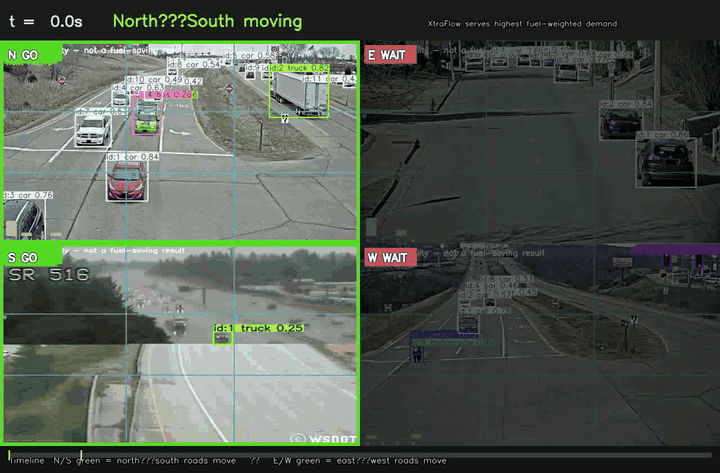

# XtraFlow

**Adaptive traffic signals that weight fuel, not just queues.**

XtraFlow is a SUMO-based signal control stack for mixed urban traffic. It scores approaches by estimated fuel pressure—who is waiting, what they burn, and which turn they need—then serves the phase that clears the most costly delay under hard safety constraints.


<p align="center"><em>Same demand seed · fixed timing (left) · XtraFlow (right)</em></p>

### Story video — which roads move when



<p align="center"><em>Four CCTV cams · green = GO (served) · dim = WAIT · <a href="results/demo/yolo/yolo_story.mp4">full MP4</a> · input feasibility, not a fuel claim</em></p>

> Simulation-based estimate · assumed traffic mix · oracle detector unless camera mode is on · proxy emission classes. Not a field deployment result.

---

## Why XtraFlow

| Classic pressure | XtraFlow |
| --- | --- |
| Counts vehicles in queue | Weights idle / stop-go fuel by vehicle class |
| One-size green splits | Adapts every cycle under min/max green, yellow, all-red |
| Opaque “smart” claim | Locked configs, seeded demand, paired comparisons on disk |

Built for presentations, reproducible benchmarks, and engineering review—not marketing slides with invented percentages.

---

## What’s in the box

- **Fuel-weighted pressure controller** with starvation protection and shared timing constraints
- **Fair baselines** in one pipeline: legacy fixed, validation-tuned fixed, Webster, SUMO actuated, queue pressure, max-pressure, count-only ablation, optional PPO
- **Four demand patterns**: balanced, peak unbalanced, dynamic blocks, low demand
- **Locked evaluation**: train / validation / test seed split, config hash lock, tripinfo fuel and SSM safety
- **Extras**: detection-miss robustness, demand/mix sensitivity, emission cross-check, demo video, YOLO CCTV demo + story mosaic, auto-filled deck

---

## Evidence

Numbers are not hardcoded here. Open the artifacts:

| Artifact | What it is |
| --- | --- |
| [`results/headlines.json`](results/headlines.json) | Paired fuel change vs best tuned baseline |
| [`results/REPORT.md`](results/REPORT.md) | Full methods + tables |
| [`results/raw_runs.csv`](results/raw_runs.csv) | Every locked TEST run |
| [`results/deck.pptx`](results/deck.pptx) | Slide deck filled from those files |
| [`results/demo/yolo/yolo_story.gif`](results/demo/yolo/yolo_story.gif) / [`.mp4`](results/demo/yolo/yolo_story.mp4) | CCTV story: which roads get green when (feasibility demo) |
| [`STATE.md`](STATE.md) · [`results/CHANGES.md`](results/CHANGES.md) | Published scope and cuts |


**Published package:** full-hour simulations, TEST seeds 1–5, eight controllers (PPO trained to the config budget and kept on disk, not scored in this TEST table). Details in `STATE.md`.

---

## Quick start

```bash
python3.12 -m venv .venv
source .venv/bin/activate
make setup
make smoke          # short sanity sweep
# or the full protocol:
make all
```

Docker:

```bash
docker build -t xtraflow .
docker run --rm -v "$PWD/results:/app/results" xtraflow
```

Dashboard and deck after a run:

```bash
make demo
make deck
make dashboard        # Streamlit UI over SUMO results/
make yolo_demo        # 4-cam YOLO overlays + mosaic + story video
make yolo_dashboard   # Streamlit: story / clubbed / per-cam + decisions
```

---

## How it works

```text
demand (scenario + seed)
        │
        ▼
   SUMO network  ──►  TraCI loop  ──►  tripinfo + SSM
        │                  │
        │                  ├─ observe vehicles (oracle or camera noise)
        │                  ├─ fuel-weighted phase pressure
        │                  └─ serve under min/max green, yellow, all-red
        ▼
  results/raw_runs.csv → analyze → figures, REPORT, deck
```

Controllers share the same network, demand files, and timing hard rules. Demand is regenerated from scenario + seed only—never from the controller under test.

**Seeds:** TRAIN `1000–1049` · VALIDATION `2000–2019` · TEST `1–30` (config). Tuning and fixed-plan search stay on VALIDATION. The publish on this branch used TEST seeds `1–5` after `results/config.lock`.

---

## Bring your own data

| Input | Path | Effect |
| --- | --- | --- |
| Observed approach counts | `data/observed_counts.csv` | Scales demand / GEH calibration |
| Road video you have rights to | `data/video/` | YOLO counts + overlay / story demo |
| Manual labels | `data/video_labels/` | Empirical noise model |

```bash
python -m perception.yolo_counts --video data/video/YOUR.mp4 --roi perception/roi.yaml
python -m perception.evaluate_detector
make yolo_demo        # overlays, mosaic, decisions, story video
make yolo_dashboard   # http://localhost:8501 by default (or set --server.port)
```

**YOLO demo (input feasibility — not a fuel-saving result)**

Place up to four clips as `data/video/cam_{N,E,S,W}_hwy.mp4` (preferred) or Bellevue-style names; `data/video/` is gitignored. Needs `ultralytics` + `lapx` (ByteTrack). Then:

| Step | Command / artifact |
| --- | --- |
| Run pipeline | `make yolo_demo` |
| Story video (GO/WAIT mosaic) | [`results/demo/yolo/yolo_story.mp4`](results/demo/yolo/yolo_story.mp4) |
| 2×2 mosaic | `results/demo/yolo/yolo_mosaic.mp4` |
| Per-cam overlays | `results/demo/yolo/overlay_{N,E,S,W}.mp4` |
| Counts + phase timeline | `results/demo/yolo/counts_*.json`, `yolo_demo_summary.json` |
| UI | `make yolo_dashboard` → **Story video** · clubbed · per-cam · **Decisions & fuel** |

The story banner shows **North–South** or **East–West** moving; green tiles are served, dimmed tiles wait. Clip idle-fuel figures are illustrative proxies from detector counts; published % fuel cuts stay in [`results/headlines.json`](results/headlines.json). Provenance: [`results/demo/yolo/SOURCE.md`](results/demo/yolo/SOURCE.md).

Only use datasets you are allowed to use. Nothing unlicensed is downloaded by this repo.

---

## Repository map

```text
sim/           network, demand, controllers, RL env, metrics
experiments/   calibrate, tune, train, sweep, analyze, studies
perception/    detector counts + noise model
demo/          side-by-side SUMO demo, YOLO pipeline, story video, dashboards
deck/          PowerPoint builder
results/       locked runs, figures, REPORT, deck, YOLO demo outputs
docs/          design decisions
```

Common Make targets:  
`setup` · `test` · `smoke` · `calibrate` · `tune` · `train_rl` · `sweep` · `analyze` · `robustness` · `sensitivity` · `emission_xcheck` · `safety` · `demo` · `yolo_demo` · `yolo_dashboard` · `deck` · `audit` · `all`

---

## Honest limits

- Simulation only; assumed vehicle mix unless you supply counts
- Default information mode is an **oracle** (SUMO speed, class, route turn)
- Emission classes are **proxies** (HBEFA3 / PHEMlight on the pinned SUMO wheel)
- YOLO CCTV demo is **input feasibility** (phase choice from detections); fuel headlines come from SUMO, not from those clips
- 2×2 grid scoring is not part of the current published package—see `results/grid_results.json`

Design rationale: [`docs/DECISIONS.md`](docs/DECISIONS.md)
